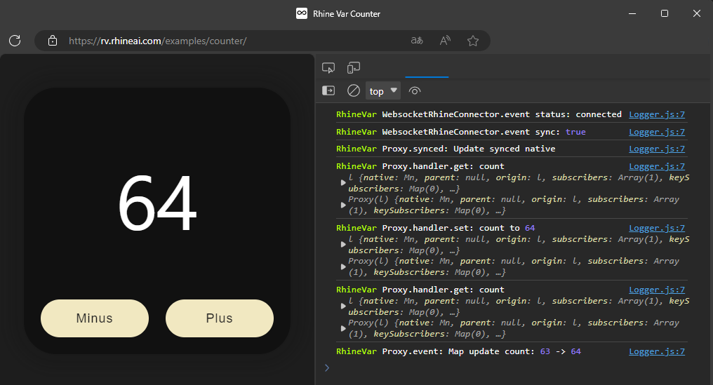

<div align="center">

# RHINE-VAR: Simplest and Powerful CRDT Library

Rhine Variable — A self-synchronizing variable for collaboration.


[English](README.md) &nbsp; | &nbsp; [中文](README_zh.md)



</div>

```typescript jsx
const state = rhineProxy({count: 0}, 'room-0')   // Create
function Counter() {
  const snap = useRhine(state)   // Hook for React
  return <div>
    <span>{snap.count}</span>   // Automatic Update
    <button onClick={() => state.count-- }> -1 </button>   // Operate Anyway
    <button onClick={() => state.count++ }> +1 </button>
  </div>
} 
```

Try: [https://rv.rhineai.com/examples/counter](https://rv.rhineai.com/examples/counter)

<br/>

## Overview

**Document:** [LEARN.md](assets/documents/LEARN.md)

**Github:** [https://github.com/RhineAI-Lab/rhine-var](https://github.com/RhineAI-Lab/rhine-var)

**Npm:** [https://www.npmjs.com/package/rhine-var](https://www.npmjs.com/package/rhine-var)

<br/>

## Why Choose RHINE-VAR ?

<div style="height: 6px"></div>

### Concise and Efficient Syntax Design
RhineVar draws inspiration from the design philosophy of the Valtio state management library, `significantly reducing the learning curve`. Allowing developers to handle data seamlessly, as if `working with standard variables`.

### Comprehensive Type Support
RhineVar offers full type hints and checks, ensuring `Precise Code Completion` and `Static Analysis` during development. This not only improves the development experience but also reduces potential errors, making it especially `suitable for TypeScript projects`, enhancing code safety and reliability.

### Distributed Real-time Collaboration Algorithm
The underlying collaboration algorithm of RhineVar is `Powered By the Robust Yjs Library`. Using the CRDT (Conflict-free Replicated Data Type) algorithm, it ensures eventual consistency even in multi-user and offline environments.

### Almost No Structural Complexity Limitations
There is almost no upper limit. It can be an `Extremely Complex and Large Data Structure` to accommodate all the data for a large project. But at the very least, it is `a JavaScript Object`.

<br/>
<details>
<summary><b>More Advantages of RHINE-VAR</b></summary>

### High Performance with Low Bandwidth Requirements
The data synchronization and conflict resolution mechanism is highly efficient. Leveraging Yjs's `Incremental Update Mechanism`, only necessary data changes are transmitted rather than the entire document, making it ideal for bandwidth-constrained environments and reducing unnecessary data transfers.

### Strong Offline Support
Users can continue to work even while offline. Once reconnected, all changes are automatically synchronized, ensuring `no data is lost or conflicted`. This is crucial for building offline-first applications.

### Cross-platform and Framework Agnostic
RhineVar can be used in `All JavaScript Environments`, including browsers, Node.js, and other JavaScript platforms. It integrates with multiple frontend frameworks and libraries such as Next.js, React, Vue.js, ProseMirror, and more.

### Lightweight and Extensible
RhineVar is a highly lightweight library, with its core package `only a few KB` in size, making it suitable for various frontend applications. Its modular architecture supports feature extensions, allowing developers to import or develop custom modules as needed.

### Decentralized Architecture
With a decentralized architecture, collaborative editing becomes more scalable, efficient, and fault-tolerant. Peer-to-peer data transfer is supported without relying on a central server (currently under development).

### Native Yjs Support
RhineVar offers full support for native Yjs object operations, providing lower-level, richer API support. `Direct operations on Yjs objects automatically trigger updates in RhineVar`.

### More Friendly and Complete Event System
RhineVar offers an extensive event subscription and listening system with `Intuitive Data Change Events`. It also supports deep data change monitoring within objects, catering to a wide range of use cases.

### Fully Open Source
This is a fully open-source project, licensed under the `Apache-2.0 license` on GitHub. You are `Free to use it for both Commercial and Non-commercial Projects`, and it allows modification and distribution, as long as the original copyright notice is retained.

</details>

<br/>

## Contact Us
Welcome to join our WeChat group for communication. We look forward to having more community members participate in the creation of rhine-var.

WeChat: [FNA-04]()

Email: [RhineAILab@gmail.com](rhineailab@gmail.com) & [RhineAI@163.com](RhineAI@163.com)

<br/>

## Install
```bash
yarn add rhine-var
```
If you don't have `yarn`, you can install it via `npm i rhine-var`, or install `yarn` first using `npm i -g yarn` and then use the command above to install.

<br/>

## Usage

```typescript jsx
const defaultValue = {value: 0}
const url = 'ws://localhost:6600/room-0'

const state = rhineProxy(defaultValue, url)

function Counter() {
  
  const snap = useRhine(state)
  
  return <div>
    <button onClick={() => state.count-- }> -1 </button>
    <span>{snap.count}</span>
    <button onClick={() => state.count++ }> +1 </button>
  </div>
}
```

### Room ID

A room number corresponds to a state variable, and users who join the room will participate in collaborative activities.  
It supports using your own server and even other connection protocols.

### Default Value

When the room does not exist on the server, a default value will be used to create the room. If not connected to the server, data from the default value will also be returned.

### rhineProxy

Create a `RhineVar Object` that anyone in the room can directly modify, and the value will be synchronized to everyone real-time.

Its data structure `can be quite complex`, but `at least`, it is `an object` in JavaScript.

### useRhine

A hook for use with React. It creates a snapshot of a `RhineVar Object`, and whenever someone modifies this value, the information will be `updated on everyone's screen` in real-time.

Note: The returned snapshot is read-only. Please do not perform any operations on it! The snapshot is only for reading data within React's XML. For all other operations (such as assignment or subscription), please operate on the original RhineVar object.

<br/>

#### [Click to view the full document: LEARN.md](assets/documents/LEARN.md)


<br/>

## Server

## Server

We provide a public server on the internet for testing and trying out RHINE-VAR. You can connect to it via `wss://rvp.rhineai.com/<room-id>`.

Note that this server does not guarantee security or performance and will impose certain restrictions on users and IPs with large-scale usage.

<br/>

We also provide a basic server example that you can deploy yourself. For more details, see: https://github.com/RhineAI-Lab/rhine-var-server

```
git clone https://github.com/RhineAI-Lab/rhine-var-server.git
yarn install
yarn start
```
It will run on `Port 6600`, and you can connect to it via `ws://localhost:6600/<room-id>`. `<room-id>` can be any text, with each room ID corresponding to a `RhineVariable`.

<br/>

The server is currently fully compatible with all Yjs WebSocket servers.

In the future, more communication protocols will be supported. You can also develop your own `Connector` object to adapt to your custom communication protocol.

For more information on server development, refer to: [https://docs.yjs.dev/ecosystem/connection-provider/y-websocket](https://docs.yjs.dev/ecosystem/connection-provider/y-websocket)

When using your own server, disable RhineVar's default handshake verification unless your server supports it.

```typescript
import {enableRhineVarSyncHandshakeCheck} from 'rhine-var'

enableRhineVarSyncHandshakeCheck(false)
```

<br/>

## Develop

### Preparation (Only needed for the first-time setup)
```bash
# Install dependencies
yarn install
# Install dependencies for the NextJs environment debugging project
yarn run install-next
# Link this library to the NextJs environment debugging project
yarn run link-next
```

### Start Debugging
```bash
# Enable real-time TypeScript compilation
yarn run watch
# Start the temporary local server, default port is 6600
yarn run server
# Start the NextJs environment debugging project, default port is 6700
yarn run next
# The browser will navigate to http://localhost:6700
```

<br/>
