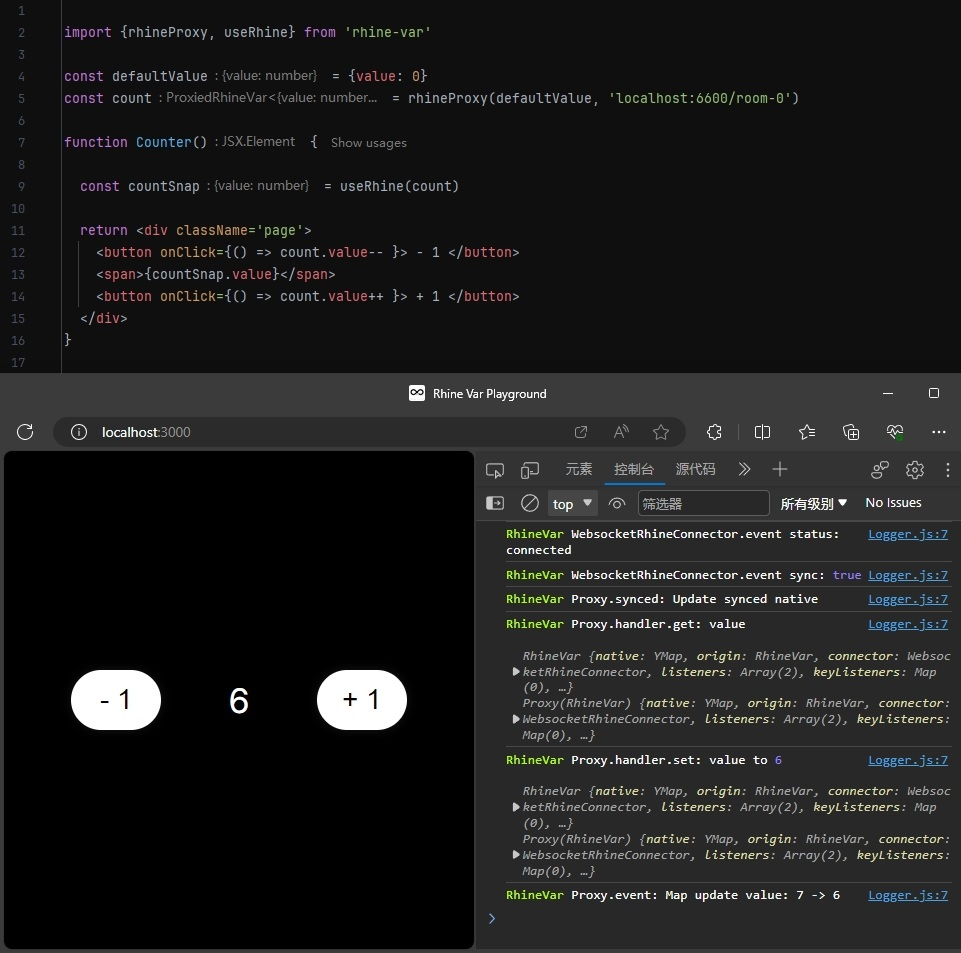

<div align="center">

# 最简单且强大的多人协同框架 RHINE-VAR

莱茵变量 —— 会自己与他人协同的变量 &nbsp; 多人协同应用开发从未如此简单 

[English](README.md) &nbsp; | &nbsp; [中文](README_zh.md)



</div>

<br/>

### **Document:** [LEARN_zh.md](assets/documents/LEARN_zh.md)

### **Github:** [https://github.com/RhineAI-Lab/rhine-var](https://github.com/RhineAI-Lab/rhine-var)

### **Npm:** [https://www.npmjs.com/package/rhine-var](https://www.npmjs.com/package/rhine-var)

<br/>

## 为什么选择 RHINE-VAR ?

<div style="height: 6px"></div>

### 简洁高效的语法设计

RHINE-VAR 借鉴了 Valtio 状态管理库的设计理念，极大地降低了学习成本。开发者可以像操作普通变量一样轻松操控协同数据。

### 完备的类型支持

RHINE-VAR 提供全面的类型提示和类型检查，确保在开发过程中能够获得精确的代码补全和静态分析。这不仅改善了开发体验，还有效降低了潜在的错误风险，特别适用于 TypeScript 项目，提升了代码的安全性和可靠性。

### 分布式实时协作算法

RHINE-VAR 的底层协同算法基于强大的 Yjs 库。通过 CRDT (Conflict-free Replicated Data Type，无冲突复制数据类型) 算法，确保多用户同时使用，甚至离线下使用的最终一致性。

### 完全开源

这是个完全开源的项目，本库在 Github 上以 Apache-2.0 许可证发布。您可以自由将其用于商业和非商业项目，并且允许对其进行修改和分发，只需要保留原作者的版权声明。

<br/>
<details>
<summary><b>更多 RHINE-VAR 的优势</b></summary>

### 高性能和低带宽需求

数据同步和冲突解决机制非常高效，通过 Yjs 的增量更新机制，仅传输必要的数据更改，而非整个文档。这使得它在网络带宽受限的环境中表现良好，减少了不必要的数据传输。

### 强大的离线支持

即使在离线状态下，用户仍然可以继续使用应用。当重新联机时，所有更改将自动同步，确保数据不会出现丢失或冲突。这对于构建离线优先的应用至关重要。

### 几乎没有体积上限

它几乎没有体积限制，可以是一个极其复杂且庞大的数据结构，以容纳一个大型项目所需的所有数据。但至少是一个 JavaScript 对象。

### 跨平台和框架无关

RHINE-VAR 支持在多种环境中使用，包括浏览器、Node.js 和其它 JavaScript 环境。此外，它可以与多个前端框架和库 (如 NextJs、React、Vue.js、ProseMirror 等) 集成。

### 轻量级且可扩展

RHINE-VAR 是一个非常轻量的库，核心包仅几 KB，适合各种前端应用。其模块化架构也支持扩展特性，开发者可以根据需要引入或开发自定义模块。

### 更友好且完善的事件体系

RHINE-VAR 提供了丰富的事件订阅监听方式，直观的数据变更事件，更好的支持数据变更的监听和处理。以及提供了对内部深层数据变化的监听，以适用更多场景。

### 原生Yjs支持

RHINE-VAR 提供完好的Yjs原生对象操作支持，更底层更丰富的API支持。直接对Yjs的对象进行操作，也将自动触发 RHINE-VAR 的更新。

### 去中心化架构

通过去中心化架构，使得协作编辑更具扩展性、更高效且更具容错能力。可通过 P2P 进行数据传输，无需依赖中央服务器（开发中）。

</details>

<br/>

## Contact Us

欢迎加入我们的微信群一起讨论交流，我们期待更多的社区开发者能加入到 RHINE-VAR 的创造中！

微信: [FNA-04]() (请备注来源)

邮箱: [RhineAILab@gmail.com](rhineailab@gmail.com) & [RhineAI@163.com](RhineAI@163.com)

<br/>

## Install
```bash
yarn add rhine-var
```
如果你的电脑未安装`yarn`, 也可通过 `npm i rhine-var` 安装。或先用 `npm i -g yarn` 安装`yarn`，然后再用上方命令进行安装。

<br/>

## Usage

```typescript jsx
const defaultValue = {count: 0}
const state = rhineProxy(defaultValue, 'room-0')

function Counter() {
  
  const snap = useRhine(state)
  
  return <div>
    <button onClick={() => state.count-- }> - 1 </button>
    <span>{snap.count}</span>
    <button onClick={() => state.count++ }> + 1 </button>
  </div>
}
```

### Room ID

一个房间号对应一个状态变量, 加入到一个房间中的用户会参与到多人协同中。支持使用自己的服务端，甚至其他链接协议。

### Default Value

当服务端无信息时，将使用 DefaultValue 作为项目默认内容。

### rhineProxy

用于创建一个 `RhineVar 对象` 它的属性的值会和房间中的其他人共享并同步。

你可以像操作 `JavaScript` 中的普通变量一样直接随意操作它。

他内部数据结构可以很复杂，但至少需要是 `JavaScript` 中的一个 `object`。

### useRhine

一个 `React` 的 `Hook` 函数. 它将为 `RhineVariable` 创建一个快照, 用于自动更新页面。

当任何人对值做出修改时，它会把最新的值立刻更新到所有人的屏幕上。

<br/>

#### [点击查看 完整文档 LEARN_zh.md](assets/documents/LEARN_zh.md)


<br/>

## Server

我们提供了一个位于公网的公共服务器，可以用于试用和测试 RHINE-VAR。你可以通过 `wss://rwq.rhineai.com/<room-id>` 连接它。

注意，该服务器无法保证安全和性能，并会对大规模使用的用户做出一定限制。

<br/>

本仓库中提供了一个简单的服务器例子，位于本项目中的 `/test/server` 处。 服务端完全兼容所有的 Yjs 的 Websocket 服务器，将来会支持更多。
```
git clone https://github.com/RhineAI-Lab/rhine-var.git
cd test/server
yarn install
yarn start
```
默认运行在 `端口 6600`, 你可以通过连接 `ws://localhost:6600/<room-id>` 连接它，`<room-id>` 可以是任意文本，一个房间号对应一个 `RhineVar 对象`。

更多服务端开发信息请参考: [https://docs.yjs.dev/ecosystem/connection-provider/y-websocket](https://docs.yjs.dev/ecosystem/connection-provider/y-websocket)

<br/>

## Develop

欢迎参与 RHINE-VAR 库的共同开发。本库内有基本的服务端，和调试用 NextJS 项目，可以满足大部分开发过程基本需求。


### 准备工作 仅初次使用时需执行
```bash
# 安装依赖
yarn install
# 安装 NextJs 环境调试项目的依赖
yarn run install-next
# 链接本库到 NextJs 环境调试项目
yarn run link-next
```

### 开始调试
```bash
# 启用 typescript 实时编译
yarn run watch
# 启用临时本地服务端 默认端口6600 
yarn run server
# 启动 NextJs 环境调试项目 默认端口6700
yarn run next
# 浏览器将跳转至 http://localhost:6700
```

<br/>

